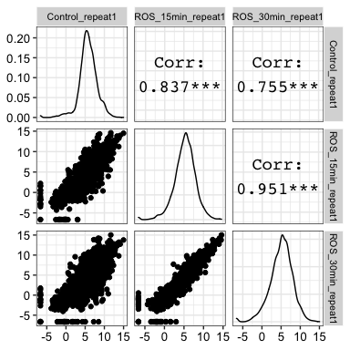
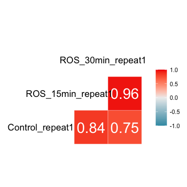

# FungalTranscriptStability

FungalTranscriptStability, is an R-package determining mRNA stability by
integration of RNASeq and RNAPII occupancy values. Detailed workflow of
how to process raw-data and analyze the transcript stability results is
described here;

1.  TPM from count matrix A count matrix generated for RNASeq data using
    standard RNASeq data analysis platforms like `HTSeq-count` or
    `StringTie` are used as an input to obtain within condition
    normalized values i.e. TPM

<!-- end list -->

``` r

dir <- system.file(file.path('extdata'),package='FungalTranscriptStability')
pattern="_S.*_HTSeqCount.txt"
gff_file <- system.file(file.path('extdata', 'C_glabrata_CBS138_version_s02-m07-r38_features.gff'), package='FungalTranscriptStability')
tpm_out <- FungalTranscriptStability::tpm_from_htseqcount(dir = dir, pattern = pattern,gff_file=gff_file, HTSeqOutput = TRUE, write_output = FALSE, drop_genes = "CaglfM*" )
#> Registered S3 method overwritten by 'GGally':
#>   method from   
#>   +.gg   ggplot2
#> [1] "/Users/Pooja/Documents/FungalTranscriptStability/renv/library/R-4.0/x86_64-apple-darwin17.0/FungalTranscriptStability/extdata/Control_repeat1_S36_HTSeqCount.txt"  
#> [2] "/Users/Pooja/Documents/FungalTranscriptStability/renv/library/R-4.0/x86_64-apple-darwin17.0/FungalTranscriptStability/extdata/ROS_15min_repeat1_S37_HTSeqCount.txt"
#> [3] "/Users/Pooja/Documents/FungalTranscriptStability/renv/library/R-4.0/x86_64-apple-darwin17.0/FungalTranscriptStability/extdata/ROS_30min_repeat1_S38_HTSeqCount.txt"
#> [1] "V1"                "Control_repeat1"   "ROS_15min_repeat1"
#> [4] "ROS_30min_repeat1"
#> Import genomic features from the file as a GRanges object ...
#> OK
#> Prepare the 'metadata' data frame ... OK
#> Make the TxDb object ... OK
#> Joining, by = "gene_id"
```



``` r
head(tpm_out)
#> # A tibble: 6 x 4
#>   gene_id      Control_repeat1 ROS_15min_repeat1 ROS_30min_repeat1
#>   <chr>                  <dbl>             <dbl>             <dbl>
#> 1 CAGL0A00154g            6.02             10.8               3.75
#> 2 CAGL0A00165g           33.8              39.8              35.2 
#> 3 CAGL0A00187g           42.1              65.9              80.5 
#> 4 CAGL0A00209g          306.              120.               59.9 
#> 5 CAGL0A00231g           34.3               2.24              1.92
#> 6 CAGL0A00253g          166.              106.              127.
```

2.  DESeq output from count matrix

A count matrix of RNASeq data using standard RNASeq data analysis
platforms like `HTSeq-count` or `StringTie` are used as an input to
obtain normalized values across different conditions and libraries using
DESeq2.

``` r
dir <- system.file(file.path('extdata'),package='FungalTranscriptStability')
pattern="_S.*_HTSeqCount.txt"
metadata <- system.file(file.path('extdata', 'metadata.txt'), package='FungalTranscriptStability')
de_out <- FungalTranscriptStability::deseq_from_htseqcount(dir = dir, pattern = pattern, metadata_file = metadata, drop_genes = "CaglfM*", write_output = FALSE)
#> [1] "/Users/Pooja/Documents/FungalTranscriptStability/renv/library/R-4.0/x86_64-apple-darwin17.0/FungalTranscriptStability/extdata/Control_repeat1_S36_HTSeqCount.txt"  
#> [2] "/Users/Pooja/Documents/FungalTranscriptStability/renv/library/R-4.0/x86_64-apple-darwin17.0/FungalTranscriptStability/extdata/ROS_15min_repeat1_S37_HTSeqCount.txt"
#> [3] "/Users/Pooja/Documents/FungalTranscriptStability/renv/library/R-4.0/x86_64-apple-darwin17.0/FungalTranscriptStability/extdata/ROS_30min_repeat1_S38_HTSeqCount.txt"
#> [1] "V1"                "Control_repeat1"   "ROS_15min_repeat1"
#> [4] "ROS_30min_repeat1"
#> Parsed with column specification:
#> cols(
#>   X1 = col_character(),
#>   X2 = col_character()
#> )
#> [1] TRUE
#>             colData condition
#> 1   Control_repeat1 untreated
#> 2 ROS_15min_repeat1   treated
#> 3 ROS_30min_repeat1   treated
#> using pre-existing size factors
#> estimating dispersions
#> gene-wise dispersion estimates
#> mean-dispersion relationship
#> final dispersion estimates
#> fitting model and testing
#> DESeqResults object of length 6 with 2 metadata columns          Gene   baseMean log2FoldChange     lfcSE       stat       pvalue
#> 1 CAGL0A00154g   10.52515     0.67777648 1.6457789  0.4118272 6.804661e-01
#> 2 CAGL0A00165g  211.32606     0.56599088 0.6349885  0.8913403 3.727466e-01
#> 3 CAGL0A00187g 1018.08551     1.22056306 0.5696854  2.1425213 3.215155e-02
#> 4 CAGL0A00209g 2227.10472    -1.36457594 0.6041264 -2.2587590 2.389838e-02
#> 5 CAGL0A00231g  178.67834    -3.62696495 0.6669081 -5.4384780 5.373763e-08
#> 6 CAGL0A00253g  602.97420    -0.09249982 0.5808748 -0.1592423 8.734780e-01
#>           padj Control_repeat1 ROS_15min_repeat1 ROS_30min_repeat1
#> 1 8.266705e-01        7.532661          17.56552          6.477286
#> 2 5.928717e-01      160.069039         243.96551        229.943645
#> 3 1.175384e-01      539.526819        1092.96547       1421.764228
#> 4 9.401305e-02     3760.680829        1905.85855       1014.774771
#> 5 2.149151e-06      461.375465          39.03448         35.625072
#> 6 9.402465e-01      628.977164         518.18274        661.762697
```



``` r

head(de_out)
#>           Gene   baseMean log2FoldChange     lfcSE       stat       pvalue
#> 1 CAGL0A00154g   10.52515     0.67777648 1.6457789  0.4118272 6.804661e-01
#> 2 CAGL0A00165g  211.32606     0.56599088 0.6349885  0.8913403 3.727466e-01
#> 3 CAGL0A00187g 1018.08551     1.22056306 0.5696854  2.1425213 3.215155e-02
#> 4 CAGL0A00209g 2227.10472    -1.36457594 0.6041264 -2.2587590 2.389838e-02
#> 5 CAGL0A00231g  178.67834    -3.62696495 0.6669081 -5.4384780 5.373763e-08
#> 6 CAGL0A00253g  602.97420    -0.09249982 0.5808748 -0.1592423 8.734780e-01
#>           padj Control_repeat1 ROS_15min_repeat1 ROS_30min_repeat1
#> 1 8.266705e-01        7.532661          17.56552          6.477286
#> 2 5.928717e-01      160.069039         243.96551        229.943645
#> 3 1.175384e-01      539.526819        1092.96547       1421.764228
#> 4 9.401305e-02     3760.680829        1905.85855       1014.774771
#> 5 2.149151e-06      461.375465          39.03448         35.625072
#> 6 9.402465e-01      628.977164         518.18274        661.762697
```

### More updates coming soon…
